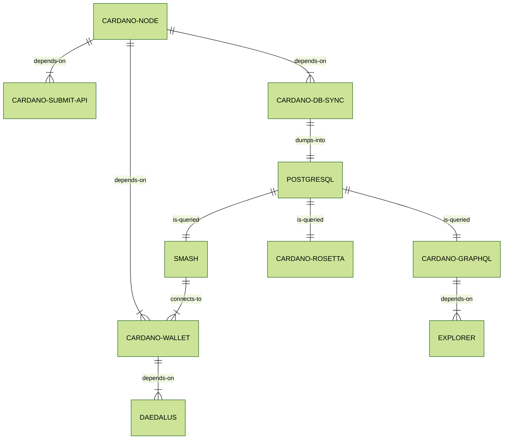

# Architecture

Adrestia is a collection of products which makes it easier to integrate with Cardano.

It comes in different flavours: SDK or high-level APIs. Depending on the use-cases you have and the control that you seek, you may use any of the components below.

## Cardano Network Protocol

An implementation of the protocol is [here][ouroboros-network] and is realized through [cardano-node][cardano-node], deployed as core and relay nodes to form the Cardano network.

[ouroboros-network]: https://github.com/input-output-hk/ouroboros-network
[cardano-node]: https://github.com/input-output-hk/cardano-node

## Services

Service applications for integrating with Cardano.

- [cardano-wallet][cardano-wallet]: HTTP REST API for managing UTxOs, and much more.
- [cardano-graphql][cardano-graphql]: HTTP GraphQL API for exploring the blockchain.
- [cardano-rosetta][cardano-rosetta]: [Rosetta](https://www.rosetta-api.org/docs/1.4.4/welcome.html) implementation for Cardano.
- [cardano-submit-api][cardano-submit-api]: HTTP API for submitting signed transactions.

## Software Libraries

- [cardano-addresses][cardano-addresses]: Address generation, derivation &  mnemonic manipulation.
- [cardano-coin-selection][cardano-coin-selection]: Algorithms for coin selection and fee balancing.
- [cardano-transactions][cardano-transactions]: Utilities for constructing and signing transactions.
- [bech32][bech32]: Haskell implementation of the Bech32 address format (BIP 0173).

## High-Level Diagram

## Components

### [cardano-node][cardano-node]

The core [cardano-node][cardano-node], which participates in the Cardano network, and maintains the state of the Cardano blockchain ledger.


Supported environments: Linux (64-bits), MacOS (64-bits), Windows (64-bits), Docker


### [cardano-wallet][cardano-wallet]

[cardano-wallet][cardano-wallet] An HTTP REST API is recommended for 3rd party wallets and small exchanges who do not want to manage UTxOs for transactions themselves. Use it to send and receive payments from hierarchical deterministic wallets on the Cardano blockchain via HTTP REST or a command-line interface.


Supported environments: Linux (64-bits), MacOS (64-bits), Windows (64-bits), Docker


### [cardano-db-sync][cardano-db-sync]

This application stores blockchain data fetched from [cardano-node][cardano-node] in a PostgreSQL database to enable higher-level interfaces for blockchain exploration. It powers [cardano-graphql][cardano-graphql].


Supported environments: Linux (64-bits), MacOS (64-bits), Docker


### [cardano-graphql][cardano-graphql]

A GraphQL API for Cardano, which also serves as the backend of
[Cardano Explorer](https://explorer.cardano.org/).


Supported environments: Linux (64-bits), MacOS (64-bits), Docker


### [cardano-submit-api][]

A small HTTP API for submitting transactions to a local [cardano-node][].

The transaction must be fully signed and CBOR-encoded. This could be done by [cardano-cli][], for example.

### [cardano-rosetta][cardano-rosetta]

[Cardano-rosetta][] is an implementation of the [Rosetta](https://www.rosetta-api.org/docs/1.4.4/welcome.html) specification for Cardano. Rosetta is an open-source specification and set of tools that makes integrating with blockchains simpler, faster, and more reliable.

## Components

### APIs

name / link       | description                                    | Byron | Jörm | Shelley | Mary  | Alonzo |
---               | ---                                            | ---   | ---  | ---     | ---   | ---    |
[cardano-wallet]  | JSON/REST API for managing UTxOs in HD wallets | ✔     | ✔    | ✔       | ❌     | 🚧     |
[cardano-graphql] | GraphQL/HTTP API for browsing on-chain data    | ✔     | ❌    | ✔       | ✔     | 🚧     |
[cardano-rosetta] | Implementation of [Rosetta][] spec for Cardano |       |      | ✔       | ✔     | 🚧     |
~[cardano-rest]~  | _Deprecated_                                   | ✔     | ❌    | ✔       | ❌     | ❌     |

### CLIs

Name / Link            | Description                                          | Byron | Jörm | Shelley | Mary  | Alonzo |
---                    | ---                                                  | ---   | ---  | --      | ---   | ---    |
[bech32]               | Human-friendly Bech32 address encoding               | N/A   | ✔    | ✔       | ✔     | ✔     |
[cardano-wallet]       | Command-line for interacting with cardano-wallet API | ✔     | ✔    | ✔       | ✔     | 🚧     |
[cardano-addresses]    | Addresses and mnemonic manipulation & derivations    | ✔     | ✔    | ✔       | ✔     | 🚧     |
[cardano-transactions] | _Deprecated_                                         | ✔     | ❌   | ❌       | ❌     | ❌     |

### Haskell SDKs

Name / Link              | Description                                       | Byron | Jörm | Shelley | Mary  | Alonzo |
---                      | ---                                               | ---   | ---  | ---     | ---   | ---    |
[bech32]                 | Human-friendly Bech32 address encoding            |       | ✔    | ✔       | ✔     | ✔     |
[cardano-addresses]      | Addresses and mnemonic manipulation & derivations | ✔     | ✔    | ✔       | ✔     | 🚧     |
[cardano-coin-selection] | _Deprecated_                                      | ✔     | ✔    | ✔       | ❌     | ❌     |
[cardano-transactions]   | _Deprecated_                                      | ✔     | ❌   | ❌       | ❌     | ❌     |

### Rust SDKs (+WebAssembly support)

Name / Link                    | Description                                           | Byron | Jörmungandr | Shelley
---                            | ---                                                   | ---   | ---         | ---
[cardano-serialization-lib]    | Binary serialization of on-chain data types           | N/A   | N/A         | ✔
[react-native-haskell-shelley] | React Native bindings for [cardano-serialization-lib] | N/A   | N/A         | 🚧

### JavaScript SDKs

Name / Link         | Description                                              | Byron | Jörm | Shelley | Mary  | Alonzo |
---                 | ---                                                      | ---   | ---  | ---     | ---   | ---    |
[cardano-launcher]  | node and cardano-wallet launcher for NodeJS applications | ✔     | ✔    | ✔       | ✔     | 🚧     |
[cardano-addresses] | Address validation and inspection                        | ✔     | ✔    | ✔       | ✔     | 🚧     |

### Formal Specifications

Name / Link                 | Description
---                         | ---
[utxo-wallet-specification] | Formal specification for a UTxO wallet

### Internal

> :warning: Here be dragons. These tools are used internally by other tools and
> does not benefit from the same care in documentation than other tools above.

name / link        | description
---                | ---
[persistent]       | Fork of the persistent Haskell library maintained for cardano-wallet

[cardano-wallet]: https://github.com/input-output-hk/cardano-wallet
[cardano-rest]: https://github.com/input-output-hk/cardano-rest
[cardano-graphql]: https://github.com/input-output-hk/cardano-graphql
[cardano-coin-selection]: https://github.com/input-output-hk/cardano-coin-selection
[cardano-addresses]: https://github.com/input-output-hk/cardano-addresses
[cardano-transactions]: https://github.com/input-output-hk/cardano-transactions
[cardano-serialization-lib]: https://github.com/Emurgo/cardano-serialization-lib
[react-native-haskell-shelley]: https://github.com/Emurgo/react-native-haskell-shelley
[bech32]: https://github.com/input-output-hk/bech32
[utxo-wallet-specification]: https://github.com/input-output-hk/utxo-wallet-specification
[rosetta]: https://www.rosetta-api.org/
[cardano-launcher]: https://github.com/input-output-hk/cardano-launcher
[cardano-rosetta]: https://github.com/input-output-hk/cardano-rosetta
[persistent]: https://github.com/input-output-hk/persistent

# Contributing

See [CONTRIBUTING.md](CONTRIBUTING.md)

[cardano-graphql]: https://github.com/input-output-hk/cardano-graphql
[cardano-db-sync]: https://github.com/input-output-hk/cardano-db-sync
[cardano-node]: https://github.com/input-output-hk/cardano-node
[cardano-rest]: https://github.com/input-output-hk/cardano-rest
[cardano-sl-explorer]: https://cardanodocs.com/technical/explorer/api/
[cardano-wallet]: https://github.com/input-output-hk/cardano-wallet
[cardano-rosetta]: https://github.com/input-output-hk/cardano-rosetta
[cardano-submit-api]: https://github.com/input-output-hk/cardano-node/tree/master/cardano-submit-api
[cardano-cli]: https://docs.cardano.org/projects/cardano-node/en/latest/reference/cardano-node-cli-reference.html
[ouroboros]: https://iohk.io/en/research/library/papers/ouroboros-praosan-adaptively-securesemi-synchronous-proof-of-stake-protocol/

[cardano-wallet]: https://github.com/input-output-hk/cardano-wallet
[cardano-submit-api]: https://github.com/input-output-hk/cardano-node/tree/master/cardano-submit-api
[cardano-rosetta]: https://github.com/input-output-hk/cardano-rosetta
[cardano-graphql]: https://github.com/input-output-hk/cardano-graphql
[cardano-coin-selection]: https://github.com/input-output-hk/cardano-coin-selection
[cardano-addresses]: https://github.com/input-output-hk/cardano-addresses
[cardano-transactions]: https://github.com/input-output-hk/cardano-transactions
[bech32]: https://github.com/input-output-hk/bech32

